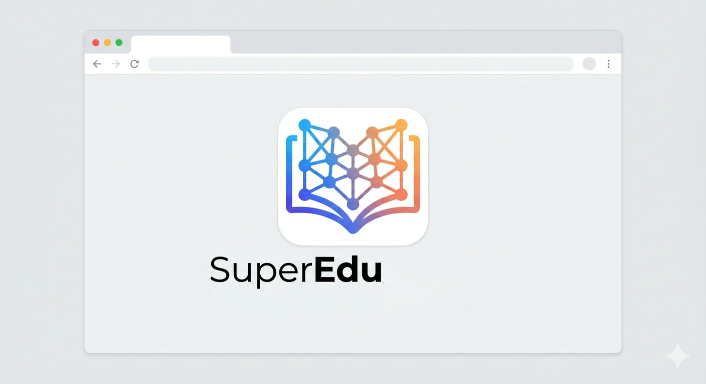

# SuperEdu

Plateforme web educative orientee vers l apprentissage, la collaboration academique et l accompagnement des etudiants.

## Sommaire

- [Objectif](#objectif)
- [Etat du projet](#etat-du-projet)
- [Public cible](#public-cible)
- [Architecture](#architecture)
- [Fonctionnalites](#fonctionnalites)
- [Apercu des pages](#apercu-des-pages)
- [Captures d ecran](#captures-d-ecran)
- [Structure du depot](#structure-du-depot)
- [Demarrage rapide](#demarrage-rapide)
- [Utilisation](#utilisation)
- [Variables d environnement](#variables-d-environnement)
- [Endpoints techniques](#endpoints-techniques)
- [Deploiement GitHub Pages](#deploiement-github-pages)
- [FAQ](#faq)
- [Roadmap](#roadmap)
- [Contribution](#contribution)
- [Licence](#licence)

## Objectif

SuperEdu a pour objectif de proposer une experience numerique moderne pour renforcer les competences academiques et professionnelles, avec un socle technique evolutif vers la production.

## Etat du projet

- Statut: stack fonctionnelle backend + node-service + frontend.
- Frontend: React/Vite avec integration des pages legacy Super_Edu.
- Priorite: stabilite de deploiement, lisibilite documentaire, industrialisation progressive.

## Public cible

- Etudiants en formation initiale ou continue.
- Enseignants souhaitant partager et structurer des contenus.
- Mentors et encadrants accompagnant la progression.

## Architecture

- [backend](backend): API Laravel.
- [node-service](node-service): passerelle Node.js pour health, readiness et exposition de statut.
- [frontend](frontend): application React/Vite servant d enveloppe aux interfaces legacy.
- [setup](setup): scripts d installation et guide de setup.

Guide de mise en route detaille: [setup/SETUP.md](setup/SETUP.md).

## Fonctionnalites

- Parcours pedagogiques et interfaces d apprentissage.
- Espaces de consultation et navigation multi-pages.
- Exposition d endpoints de supervision technique.
- Deploiement frontend automatise sur GitHub Pages.

## Apercu des pages

- /: accueil React
- /index: super_edu/index.html
- /certification: super_edu/Wpages/certification.html
- /conseils: super_edu/Wpages/conseils.html
- /mentor-ia: super_edu/Wpages/mentor IA.html
- /prototype: super_edu/Wpages/prototype.html
- /weeeelcom: super_edu/Wpages/weeeelcom.html

## Captures d ecran

### Vue principale



## Structure du depot

```text
SuperEdu/
|-- .github/
|   `-- workflows/
|       `-- static.yml                 # Deploy GitHub Pages (frontend)
|-- backend/                           # API Laravel
|   |-- app/
|   |-- config/
|   |-- database/
|   |-- public/
|   |-- routes/
|   |-- tests/
|   |-- artisan
|   `-- composer.json
|-- node-service/                      # Gateway Node.js
|   |-- src/
|   |   `-- server.js
|   |-- .env.example
|   `-- package.json
|-- frontend/                          # App React/Vite
|   |-- src/
|   |   |-- App.jsx
|   |   `-- main.jsx
|   |-- public/
|   |   `-- super_edu/                 # Interfaces legacy conservees
|   |       |-- index.html
|   |       `-- Wpages/
|   |-- vite.config.js
|   `-- package.json
|-- setup/                             # Scripts de setup
|   |-- setup.bat
|   |-- setup.sh
|   |-- setup.exe
|   `-- SETUP.md
|-- tools/
|   `-- setup-exe/                     # Source C# du lanceur setup.exe
|       |-- Program.cs
|       `-- SetupLauncher.csproj
|-- README.md
|-- setup.exe                          # Lanceur setup Windows (racine)
|-- LICENSE-GPL-3.0-or-later
|-- LICENSE-MIT
`-- LICENSE-APACHE-2.0
```

## Demarrage rapide

Depuis la racine du depot:

- Windows executable: setup.exe ou setup/setup.exe
- Windows batch: setup/setup.bat
- macOS/Linux: sh setup/setup.sh

Les scripts automatisent:

- creation des .env manquants
- installation des dependances backend, node-service et frontend
- generation de la cle Laravel si necessaire
- build de verification frontend

## Utilisation

Si vous demarrez manuellement:

1. Backend
	cd backend
	copy .env.example .env
	composer install
	php artisan key:generate
	php artisan serve --host=127.0.0.1 --port=8000

2. Node service
	cd node-service
	copy .env.example .env
	npm install
	npm start

3. Frontend
	cd frontend
	copy .env.example .env
	npm install
	npm run dev

Verification locale frontend:

cd frontend
npm run lint
npm run build

## Variables d environnement

node-service/.env

- PORT (defaut: 4000)
- LARAVEL_API_URL (defaut: http://localhost:8000/api)
- FRONTEND_ORIGINS (origines CORS separees par des virgules)

frontend/.env

- VITE_BASE_PATH (defaut: /)

## Endpoints techniques

- Laravel health: GET http://localhost:8000/api/health
- Node health: GET http://localhost:4000/health
- Node readiness: GET http://localhost:4000/ready
- Node stack status: GET http://localhost:4000/api/status

## Deploiement GitHub Pages

Le workflow [static.yml](.github/workflows/static.yml) publie uniquement frontend/dist.

Points importants:

- VITE_BASE_PATH est injecte automatiquement.
- 404.html et .nojekyll sont ajoutes pour supporter le routage SPA.
- backend et node-service ne sont pas heberges sur GitHub Pages.

Activation:

1. Ouvrir Settings du depot.
2. Aller dans Pages.
3. Choisir GitHub Actions comme source.
4. Pousser sur main.

## FAQ

Q: Le backend est il obligatoire pour visualiser les pages frontend?

R: Non pour l affichage statique de base. Oui pour les integrations API et le statut global complet.

Q: Pourquoi un endpoint ready en plus de health?

R: Health verifie la disponibilite du service lui meme. Ready verifie aussi la dependance Laravel.

Q: Peut on deployer tout le projet sur GitHub Pages?

R: Non. Seul le frontend statique est deployable sur GitHub Pages.

## Roadmap

- Structurer davantage la couche frontend par modules.
- Ajouter des tests automatises pour les flux critiques.
- Renforcer la pipeline CI/CD multi-services.
- Formaliser les environnements staging et production.

## Contribution

Les contributions sont bienvenues.

1. Fork du projet.
2. Creation d une branche de fonctionnalite.
3. Commit des modifications.
4. Ouverture d une pull request.

## Licence

SuperEdu est distribue sous tri-licence:

- GPL v3 ou ulterieure: [LICENSE-GPL-3.0-or-later](LICENSE-GPL-3.0-or-later)
- MIT: [LICENSE-MIT](LICENSE-MIT)
- Apache 2.0: [LICENSE-APACHE-2.0](LICENSE-APACHE-2.0)
