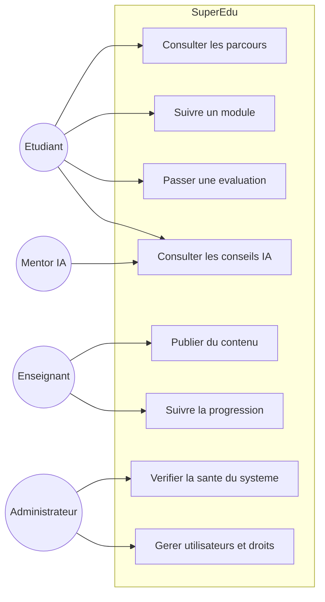
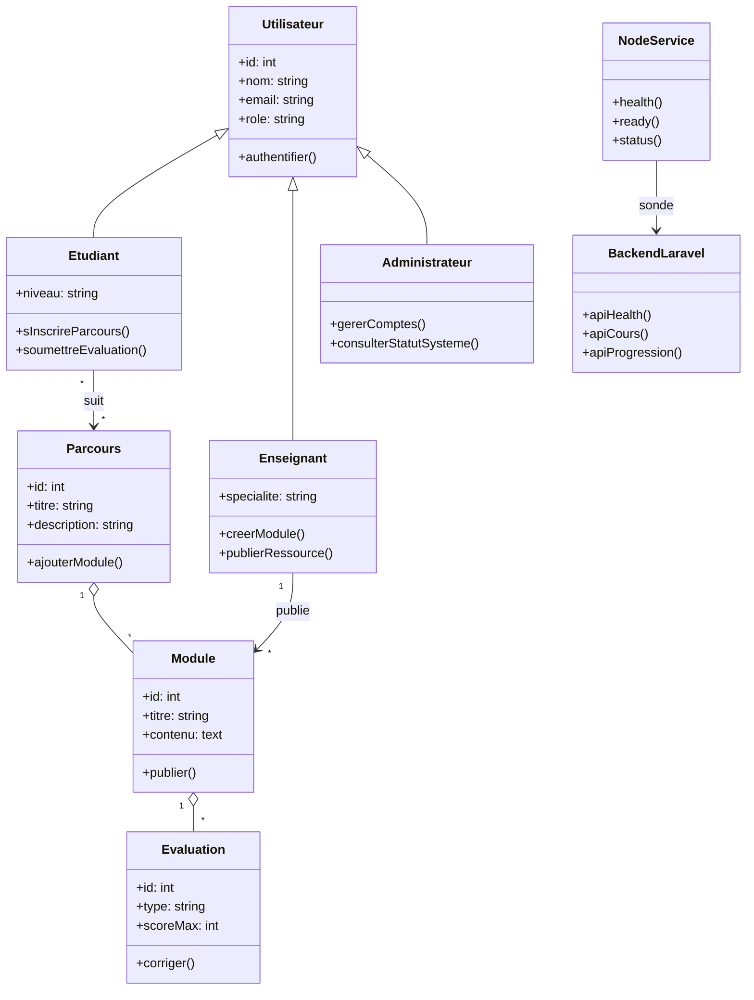
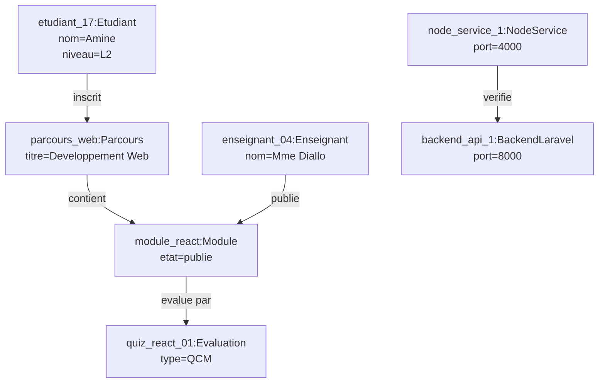
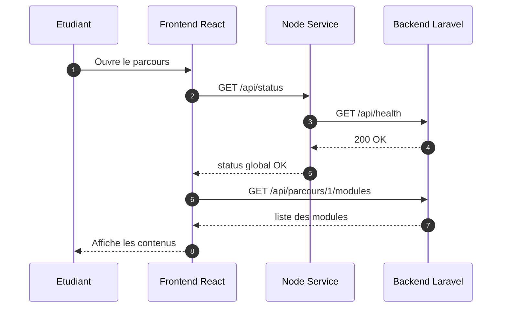
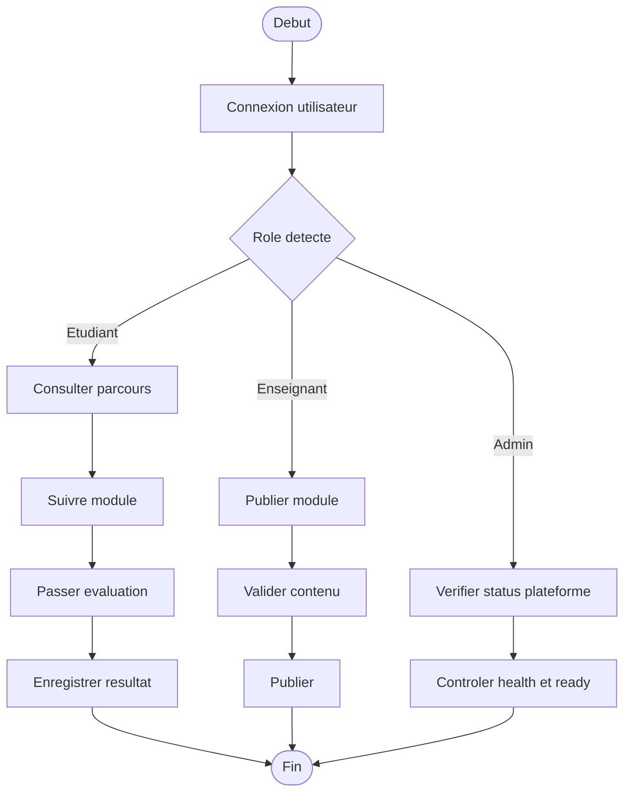
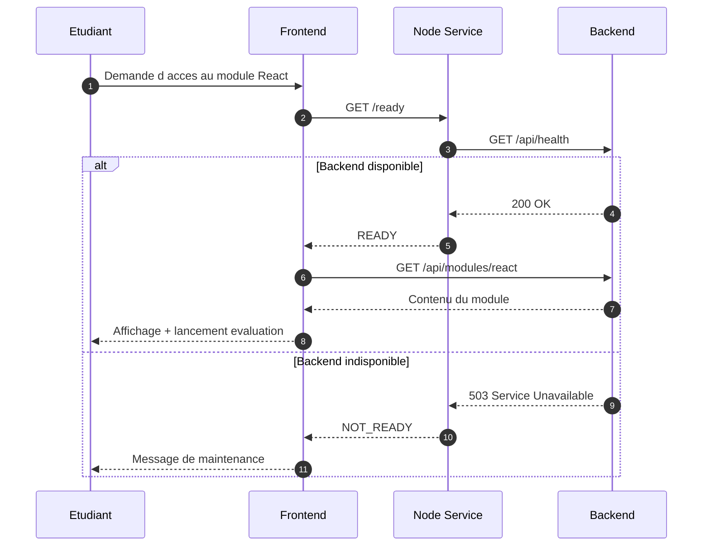

# Architecture et modelisation - SuperEdu

Ce document regroupe les diagrammes demandes pour la plateforme SuperEdu:

1. Cas d utilisation
2. Classe
3. Objets
4. Comportementaux: Sequence et Activite
5. Etude de cas (en fin de document)

## 1) Diagramme des cas d utilisation

## 2) Diagramme de classes

## 3) Diagramme d objets

## 4) Diagrammes comportementaux

### 4.1 Diagramme de sequence

### 4.2 Diagramme d activite

## 5) Etude de cas (scenario de reference)

### Contexte

Un etudiant se connecte, accede a un parcours, termine un module et passe une evaluation. Le systeme doit verifier la disponibilite technique avant de charger les donnees pedagogiques.

### Objectif

Garantir une experience continue meme en architecture multi-services (frontend, node-service, backend).

### Diagramme de sequence - Etude de cas

### Resultats attendus

- Disponibilite controlee avant usage metier.
- Degradation maitrisee en cas de panne backend.
- Visibilite operationnelle grace aux endpoints health/ready/status.
